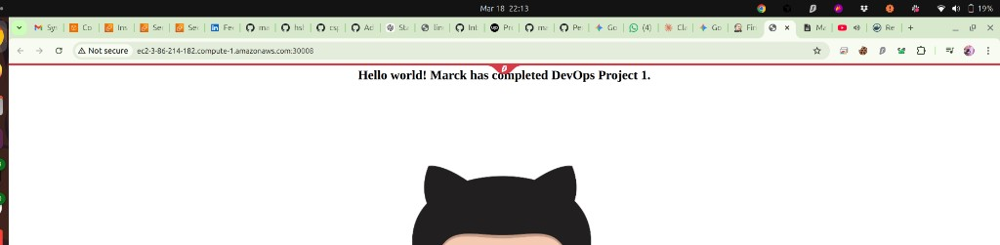

# DevOps Final Project - CI/CD Pipeline with Jenkins, Terraform, Ansible & Kubernetes

## Project Overview

This project demonstrates a complete end-to-end DevOps pipeline that provisions infrastructure using Terraform, configures machines using Ansible, builds and pushes Docker images via Jenkins, and deploys the application on a Kubernetes cluster.

---

## Architecture

```
┌──────────────────────────────────┐
│  Machine 1: Jenkins_Terraform_   │
│  Ansible (Master Controller)     │
│  - Jenkins (CI/CD)               │
│  - Terraform (Infrastructure)    │
│  - Ansible (Configuration Mgmt)  │
└────────────┬─────────────────────┘
             │ SSH + Ansible
             ▼
┌──────────────────────────────────┐
│  Machine 2: Kmaster              │
│  - Kubernetes Control Plane      │
│  - Jenkins Agent (label:KMaster) │
│  - Docker                        │
│  - kubectl, kubeadm, kubelet     │
└────────────┬─────────────────────┘
             │ kubeadm join
       ┌─────┴─────┐
       ▼           ▼
┌────────────┐ ┌────────────┐
│  Kslave1   │ │  Kslave2   │
│  Worker    │ │  Worker    │
│  Node      │ │  Node      │
└────────────┘ └────────────┘
```

---

## EC2 Instances

| Machine | Name | Public DNS | Private IP | Instance Type |
|---------|------|------------|------------|---------------|
| Machine 1 | Jenkins_Terraform_Ansible | ec2-18-207-96-211.compute-1.amazonaws.com | 172.31.23.87 | t2.medium |
| Machine 2 | Kmaster | ec2-54-85-98-45.compute-1.amazonaws.com | 172.31.95.164 | c7i-flex.large |
| Machine 3 | Kslave1 | ec2-3-86-214-182.compute-1.amazonaws.com | 172.31.89.180 | c7i-flex.large |
| Machine 4 | Kslave2 | ec2-3-83-131-247.compute-1.amazonaws.com | 172.31.89.221 | c7i-flex.large |

---

## Step-by-Step Setup Guide

### Step 1: Create Machine 1 (Jenkins_Terraform_Ansible)

Created 1 EC2 instance manually named `Jenkins_Terraform_Ansible` in the AWS Console (us-east-1 region) with Ubuntu 22.04 AMI.

#### SSH into Machine 1:
```bash
ssh -i "jenkins.pem" ubuntu@ec2-18-207-96-211.compute-1.amazonaws.com
```

---

### Step 2: Install Terraform on Machine 1

```bash
wget -O- https://apt.releases.hashicorp.com/gpg | sudo gpg --dearmor -o /usr/share/keyrings/hashicorp-archive-keyring.gpg

echo "deb [signed-by=/usr/share/keyrings/hashicorp-archive-keyring.gpg] https://apt.releases.hashicorp.com $(lsb_release -cs) main" | sudo tee /etc/apt/sources.list.d/hashicorp.list

sudo apt update && sudo apt install terraform -y
```

Verify installation:
```bash
terraform --version
# Output: Terraform v1.14.7
```

---

### Step 3: Create Terraform Configuration (main.tf)

Created `main.tf` to provision 3 EC2 instances for the Kubernetes cluster:

```hcl
provider "aws" {
  region = "us-east-1"
}

resource "aws_instance" "k8_master" {
  ami           = "ami-0b6c6ebed2801a5cb"
  instance_type = "c7i-flex.large"
  key_name      = "jenkins"
  tags = {
    Name = "Kmaster"
  }
}

resource "aws_instance" "k8_slave1" {
  ami           = "ami-0b6c6ebed2801a5cb"
  instance_type = "c7i-flex.large"
  key_name      = "jenkins"
  tags = {
    Name = "Kslave1"
  }
}

resource "aws_instance" "k8_slave2" {
  ami           = "ami-0b6c6ebed2801a5cb"
  instance_type = "c7i-flex.large"
  key_name      = "jenkins"
  tags = {
    Name = "Kslave2"
  }
}
```

#### Run Terraform:
```bash
export AWS_ACCESS_KEY_ID="xxxxx"
export AWS_SECRET_ACCESS_KEY="xxxxx"

terraform init
terraform plan
terraform apply --auto-approve
```

**Result:** 3 EC2 instances created (Kmaster, Kslave1, Kslave2).

---

### Step 4: Install Ansible on Machine 1

```bash
sudo apt update
sudo apt install software-properties-common -y
sudo add-apt-repository --yes --update ppa:ansible/ansible
sudo apt install ansible -y
```

Verify:
```bash
ansible --version
# Output: ansible [core 2.17.14]
```

---

### Step 5: Setup SSH Key-Based Authentication (Machine 1 → Kmaster)

On Machine 1:
```bash
ssh-keygen
cat /home/ubuntu/.ssh/id_rsa.pub
# Copy the public key
```

On Kmaster:
```bash
cd .ssh
sudo nano authorized_keys
# Paste the public key from Machine 1
```

---

### Step 6: Configure Ansible Hosts

On Machine 1:
```bash
sudo nano /etc/ansible/hosts
```

Added:
```ini
[test]
172.31.95.164
```

Verify connectivity:
```bash
ansible -m ping all
# Output: 172.31.95.164 | SUCCESS
```

---

### Step 7: Create Ansible Playbook and Shell Scripts

#### play.yaml (Ansible Playbook):
```yaml
---
- name: Installations on Master
  hosts: localhost
  become: true
  tasks:
    - name: Executing script on master
      script: Jenkins_terraform_ansible.sh

- name: Installations on test
  hosts: test
  become: true
  tasks:
    - name: Executing script on test
      script: K-master.sh
```

#### Jenkins_terraform_ansible.sh (runs on Machine 1):
```bash
sudo apt update
sudo apt install openjdk-17-jre -y
sudo wget -O /usr/share/keyrings/jenkins-keyring.asc \
  https://pkg.jenkins.io/debian-stable/jenkins.io-2023.key
echo deb [signed-by=/usr/share/keyrings/jenkins-keyring.asc] \
  https://pkg.jenkins.io/debian-stable binary/ | sudo tee \
  /etc/apt/sources.list.d/jenkins.list > /dev/null
sudo apt-get update
sudo apt-get install jenkins -y
sudo apt-get install docker.io -y
```

#### K-master.sh (runs on Kmaster):
```bash
sudo apt update
sudo apt install openjdk-17-jre -y
sudo apt install docker.io -y
```

---

### Step 8: Run Ansible Playbook

```bash
ansible-playbook play.yaml --syntax-check
ansible-playbook play.yaml --check
ansible-playbook play.yaml
```

**Result:** Jenkins, Java, Docker installed on Machine 1. Java, Docker installed on Kmaster.

> **Note:** The Jenkins GPG key from 2023 was outdated. We had to import the new key manually:
> ```bash
> sudo mkdir -p /tmp/gpg-tmp
> sudo gpg --homedir /tmp/gpg-tmp --no-default-keyring \
>   --keyring /tmp/jenkins-keyring.gpg \
>   --keyserver keyserver.ubuntu.com \
>   --recv-keys 7198F4B714ABFC68
> sudo cp /tmp/jenkins-keyring.gpg /usr/share/keyrings/jenkins-keyring.gpg
> echo 'deb [signed-by=/usr/share/keyrings/jenkins-keyring.gpg] https://pkg.jenkins.io/debian-stable binary/' | sudo tee /etc/apt/sources.list.d/jenkins.list
> sudo apt-get update && sudo apt-get install jenkins -y
> ```

---

### Step 9: Install Kubernetes on Kmaster

SSH into Kmaster:
```bash
ssh -i "jenkins.pem" ubuntu@ec2-54-85-98-45.compute-1.amazonaws.com
```

Install kubeadm, kubelet, kubectl:
```bash
sudo apt-get update
sudo apt-get install -y apt-transport-https ca-certificates curl gpg conntrack

curl -fsSL https://pkgs.k8s.io/core:/stable:/v1.31/deb/Release.key | sudo gpg --dearmor -o /etc/apt/keyrings/kubernetes-apt-keyring.gpg

echo 'deb [signed-by=/etc/apt/keyrings/kubernetes-apt-keyring.gpg] https://pkgs.k8s.io/core:/stable:/v1.31/deb/ /' | sudo tee /etc/apt/sources.list.d/kubernetes.list

sudo apt-get update
sudo apt-get install -y kubelet kubeadm kubectl
sudo apt-mark hold kubelet kubeadm kubectl
```

Configure prerequisites:
```bash
sudo swapoff -a
sudo modprobe overlay
sudo modprobe br_netfilter

echo -e 'overlay\nbr_netfilter' | sudo tee /etc/modules-load.d/k8s.conf

cat <<EOF | sudo tee /etc/sysctl.d/k8s.conf
net.bridge.bridge-nf-call-iptables = 1
net.bridge.bridge-nf-call-ip6tables = 1
net.ipv4.ip_forward = 1
EOF
sudo sysctl --system

sudo mkdir -p /etc/containerd
containerd config default | sudo tee /etc/containerd/config.toml
sudo sed -i 's/SystemdCgroup = false/SystemdCgroup = true/' /etc/containerd/config.toml
sudo systemctl restart containerd
sudo systemctl enable containerd
```

Initialize Kubernetes cluster:
```bash
sudo kubeadm init --pod-network-cidr=10.244.0.0/16
```

Setup kubeconfig:
```bash
mkdir -p $HOME/.kube
sudo cp -i /etc/kubernetes/admin.conf $HOME/.kube/config
sudo chown $(id -u):$(id -g) $HOME/.kube/config
```

Install Flannel CNI (Pod Network):
```bash
kubectl apply -f https://raw.githubusercontent.com/coreos/flannel/master/Documentation/kube-flannel.yml
```

Remove control-plane taint (allow scheduling on master):
```bash
kubectl taint nodes --all node-role.kubernetes.io/control-plane-
```

---

### Step 10: Install Kubernetes on Kslave1 & Kslave2

SSH into each slave:
```bash
# Kslave1
ssh -i "jenkins.pem" ubuntu@ec2-3-86-214-182.compute-1.amazonaws.com

# Kslave2
ssh -i "jenkins.pem" ubuntu@ec2-3-83-131-247.compute-1.amazonaws.com
```

On EACH slave, run the same Kubernetes installation commands (Step 9 - install kubeadm, kubelet, kubectl, configure prerequisites). Then join the cluster:

```bash
sudo kubeadm join 172.31.95.164:6443 --token xxxxx \
  --discovery-token-ca-cert-hash sha256:xxxxx
```

**Result:** 3-node Kubernetes cluster (1 master + 2 workers).

---

### Step 11: Configure AWS Security Group

The default security group needed additional ports for Kubernetes. Added the following inbound rules to security group `sg-00a69eba5b88f9665`:

| Port | Protocol | Source | Purpose |
|------|----------|--------|---------|
| 6443 | TCP | 0.0.0.0/0 | Kubernetes API Server |
| 2379-2380 | TCP | 172.31.0.0/16 | etcd |
| 10250 | TCP | 0.0.0.0/0 | Kubelet API |
| 10257 | TCP | 172.31.0.0/16 | kube-controller-manager |
| 10259 | TCP | 172.31.0.0/16 | kube-scheduler |
| 30000-32767 | TCP | 0.0.0.0/0 | NodePort Services |
| 22 | TCP | 0.0.0.0/0 | SSH (already existed) |
| 8080 | TCP | 0.0.0.0/0 | Jenkins (already existed) |
| 80 | TCP | 0.0.0.0/0 | HTTP (already existed) |

---

### Step 12: Verify Kubernetes Cluster

```bash
kubectl get nodes -o wide
```

| Node | Role | Status | Version | IP |
|------|------|--------|---------|-----|
| ip-172-31-95-164 | control-plane | Ready | v1.31.14 | 172.31.95.164 |
| ip-172-31-89-180 | worker | Ready | v1.31.14 | 172.31.89.180 |
| ip-172-31-89-221 | worker | Ready | v1.31.14 | 172.31.89.221 |

---

### Step 13: Configure Jenkins

#### Access Jenkins:
- **URL:** `http://ec2-18-207-96-211.compute-1.amazonaws.com:8080`
- **Initial Admin Password:** Found at `/var/lib/jenkins/secrets/initialAdminPassword`
- **Admin Username:** `xxxxx`
- **Admin Password:** `xxxxx`

#### Installed Plugins:
- Git
- Pipeline (workflow-aggregator)
- Pipeline Stage View
- Docker Pipeline
- SSH Build Agents (ssh-slaves)
- Credentials Binding

#### Added Credentials:
1. **SSH Key for Kmaster** (ID: `kmaster-ssh-key`)
   - Type: SSH Username with Private Key
   - Username: `ubuntu`
   - Private Key: From Machine 1's `~/.ssh/id_rsa`

2. **DockerHub Credentials** (ID: `dockerhub-creds`)
   - Type: Username with Password
   - Username: `xxxxx`
   - Password: `xxxxx`

#### Added Agent Node:
- **Name:** `KMaster`
- **Label:** `KMaster`
- **Host:** `172.31.95.164`
- **Remote Root Directory:** `/home/ubuntu/jenkins`
- **Credentials:** `kmaster-ssh-key`
- **Executors:** 3

---

### Step 14: GitHub Repository Setup

- **Repository:** https://github.com/marck-devops/csp-website.git
- **Branch:** `master`
- Forked from `hshar/website`

#### Repository Files:

**Dockerfile:**
```dockerfile
FROM ubuntu
RUN apt update
RUN apt install apache2 -y
ADD . /var/www/html/
ENTRYPOINT apachectl -D FOREGROUND
```

**deploy.yml:**
```yaml
apiVersion: apps/v1
kind: Deployment
metadata:
  name: custom-deployment
  labels:
    app: custom
spec:
  replicas: 2
  selector:
    matchLabels:
      app: custom
  template:
    metadata:
      labels:
        app: custom
    spec:
      containers:
        - name: custom
          image: marckdocker/csp-website
          ports:
            - containerPort: 80
```

**svc.yml:**
```yaml
apiVersion: v1
kind: Service
metadata:
  name: my-custom-deployment
spec:
  type: NodePort
  ports:
    - targetPort: 80
      port: 80
      nodePort: 30008
  selector:
    app: custom
```

---

### Step 15: Create & Run Jenkins Pipeline

#### Pipeline Job Name: `FinalProject`

#### Jenkinsfile (Pipeline Script):
```groovy
pipeline {
    agent none
    environment {
        DOCKERHUB_CREDENTIALS = credentials('dockerhub-creds')
    }
    stages {
        stage('Hello') {
            agent {
                label 'KMaster'
            }
            steps {
                echo 'Hello World'
            }
        }
        stage('git') {
            agent {
                label 'KMaster'
            }
            steps {
                git branch: 'master', url: 'https://github.com/marck-devops/csp-website.git'
            }
        }
        stage('docker') {
            agent {
                label 'KMaster'
            }
            steps {
                sh 'sudo docker build /home/ubuntu/jenkins/workspace/FinalProject -t marckdocker/csp-website'
                sh "echo $DOCKERHUB_CREDENTIALS_PSW | sudo docker login -u $DOCKERHUB_CREDENTIALS_USR --password-stdin"
                sh 'sudo docker push marckdocker/csp-website'
            }
        }
        stage('Kubernetes') {
            agent {
                label 'KMaster'
            }
            steps {
                sh 'kubectl apply -f deploy.yml'
                sh 'kubectl apply -f svc.yml'
            }
        }
    }
}
```

#### Pipeline Stages:
| Stage | Description | Status |
|-------|-------------|--------|
| Hello | Echo test | SUCCESS |
| Git | Clone GitHub repo | SUCCESS |
| Docker | Build image, login to DockerHub, push image | SUCCESS |
| Kubernetes | Apply deployment and service YAMLs | SUCCESS |

**Build #1 Result: SUCCESS**

---

### Step 16: Access the Deployed Application

The application (Apache web server serving the website) is accessible via NodePort **30008**:

| Node | URL |
|------|-----|
| Kmaster | http://ec2-54-85-98-45.compute-1.amazonaws.com:30008 |
| Kslave1 | http://ec2-3-86-214-182.compute-1.amazonaws.com:30008 |
| Kslave2 | http://ec2-3-83-131-247.compute-1.amazonaws.com:30008 |

---

## Kubernetes Deployment Status

```
Deployment: custom-deployment (2/2 replicas ready)

Pod 1: Running on Kslave1 (ip-172-31-89-180) - IP: 10.244.1.2
Pod 2: Running on Kslave2 (ip-172-31-89-221) - IP: 10.244.2.2

Service: my-custom-deployment (NodePort 80:30008)
```

---

## Docker Image

- **Image:** `marckdocker/csp-website:latest`
- **Registry:** Docker Hub
- **SHA:** `sha256:78a5a28741e3a9360b6b071eb98a45b9685abeb64e7c132b8e4cd9c35490ce2d`

---

## Tools & Versions

| Tool | Version | Machine |
|------|---------|---------|
| Terraform | v1.14.7 | Machine 1 |
| Ansible | core 2.17.14 | Machine 1 |
| Jenkins | 2.541.3 | Machine 1 |
| Java (OpenJDK) | 17.0.18 | All machines |
| Docker | 28.2.2 | All machines |
| Kubernetes | v1.31.14 | Kmaster, Kslave1, Kslave2 |
| Flannel CNI | Latest | Kmaster, Kslave1, Kslave2 |
| Ubuntu | 22.04 (Machine 1), 24.04 (K8s nodes) | All machines |

---

## Troubleshooting Notes

1. **Jenkins GPG Key Issue:** The Jenkins apt key from 2023 (`jenkins.io-2023.key`) was outdated. Had to import the new key `7198F4B714ABFC68` from keyserver.ubuntu.com.

2. **Kubernetes Join Failure:** Kslave1 and Kslave2 couldn't join the cluster initially because the AWS security group was missing port 6443 (K8s API server). Fixed by adding required inbound rules.

3. **conntrack Missing:** `kubeadm init` failed with "conntrack not found in system path". Fixed by installing: `sudo apt-get install -y conntrack`.

4. **GitHub Password Auth:** GitHub no longer supports password authentication for git operations. Used a Personal Access Token (PAT) instead.

---

## Project Flow Summary

```
1. Terraform provisions 3 EC2 instances (Kmaster, Kslave1, Kslave2)
2. Ansible configures Machine 1 (Jenkins + Docker) and Kmaster (Java + Docker)
3. Kubernetes cluster initialized on Kmaster, slaves joined
4. Jenkins configured with Kmaster as agent + DockerHub credentials
5. Pipeline triggered:
   a. Clones GitHub repo on Kmaster
   b. Builds Docker image from Dockerfile
   c. Pushes image to DockerHub (marckdocker/csp-website)
   d. Deploys to Kubernetes (2 replicas + NodePort service)
6. Website accessible on port 30008 on any node
```

---

## Application Running - Screenshot

The deployed application is successfully accessible via the NodePort service on port **30008**:



**URL:** `http://ec2-3-86-214-182.compute-1.amazonaws.com:30008`

> "Hello world! Marck has completed DevOps Project 1."
